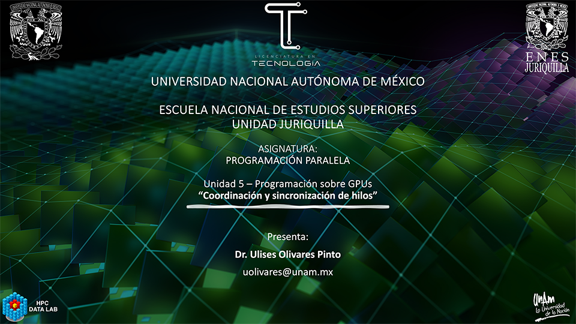

# Programación Paralela
## Coordinación y Sincronización de Hilos en CUDA
### Licenciatura en Tecnología

## Profesor
 Dr. Ulises Olivares Pinto

## Objetivo del curso
Presentar al estudiante el modelo de programación paralela empleando Unidades de
Procesamiento Gráfico (GPUs). Se profundizará en los conceptos de coordinación y sincronización de hilos.

## Prerequisitos
#### Deseables
+ Dominio de los lenguajes de programación C y C++ 
+ Conicimiento básico de estructuras de datos y algoritmos

#### Hardware
Se deberá contar con una computadora con GPU de la marca NVIDIA

#### Software
Se deberá contar con el siguiente software instalado 

  + [CUDA Toolkit] (https://developer.nvidia.com/cuda-toolkit)
  + Entonrno de desarrollo integrado(IDE)
    - Eclipse
    - Clion
  + [NVIDIA NSIGHT](https://developer.nvidia.com/nsight-visual-studio-edition)
    

#### Cuentas
Se deberán crear cuentas en las siguientes plataformas:
  + Crear una cuenta en GitHub

## Contenido del Curso sobre Coordinación y Sincronización de Hilos en CUDA

| No. | Tema                                              | Conceptos Clave                            | Recursos Adicionales                                      |
|:---:|---------------------------------------------------|--------------------------------------------|--------------------------------------------------------------|
|  1  | [Introducción a CUDA](https://developer.nvidia.com/cuda-zone) | Introducción a la programación en CUDA, modelo de programación paralela en GPU | - [Programming Massively Parallel Processors](https://developer.nvidia.com/gpugems/GPUGems2/gpugems2_chapter01.html) |
|  2  | [Modelo de Ejecución Paralela](https://docs.nvidia.com/cuda/cuda-c-programming-guide/index.html#execution-configuration) | Hilos, bloques, warps en CUDA, asignación de hilos a bloques | - [NVIDIA CUDA C Best Practices Guide](https://docs.nvidia.com/cuda/cuda-c-best-practices-guide/index.html) |
|  3  | [Barreras de Sincronización en CUDA](https://developer.nvidia.com/blog/using-cuda-warp-level-primitives/) | Uso de `__syncthreads()` para sincronizar hilos dentro de un bloque | - Ejemplo de Barrera de Sincronización: [Enlace](https://developer.nvidia.com/blog/how-implement-warp-level-synchronization-cuda/) |
|  4  | [Sincronización entre Bloques](https://developer.nvidia.com/blog/cuda-pro-tip-write-flexible-kernels-grid-stride-loops) | Uso de sincronización entre bloques con variables compartidas | - Ejemplo de Sincronización entre Bloques: [Enlace](https://github.com/NVIDIA-developer-blog/code-samples/tree/master/series/cuda-coding-essentials) |
|  5  | [Sincronización con Eventos](https://docs.nvidia.com/cuda/cuda-runtime-api/group__CUDART__EVENT.html) | Creación y uso de eventos para sincronizar ejecución de kernels | - Ejemplo de Sincronización con Eventos: [Enlace](https://developer.nvidia.com/blog/how-overlap-data-transfers-cuda-coding/) |
|  6  | [Semáforos y Mutex en CUDA](https://developer.nvidia.com/blog/how-optimize-data-transfers-cuda-cc/) | Implementación de semáforos y mutex para control de acceso | - Ejemplo de Semáforos en CUDA: [Enlace](https://devblogs.nvidia.com/cuda-pro-tip-cuda-7-streams-simplify-concurrency/) |
|  7  | [Cooperación y Comunicación entre Bloques](https://developer.nvidia.com/blog/cooperative-groups/) | Uso de Cooperative Groups para colaboración entre bloques | - Ejemplo de Cooperación entre Bloques: [Enlace](https://developer.nvidia.com/blog/cuda-pro-tip-kepler-shuffle/) |
|  8  | [Optimización y Buenas Prácticas](https://docs.nvidia.com/cuda/cuda-c-best-practices-guide/index.html) | Estrategias de optimización para sincronización y coordinación | - Ejemplo de Optimización en CUDA: [Enlace](https://developer.nvidia.com/blog/how-optimize-data-transfers-cuda-cc/) |
|  9  | [Estudios de Caso y Aplicaciones](https://developer.nvidia.com/cuda-gpus) | Ejemplos prácticos de aplicaciones con sincronización en CUDA | - Ejemplo de Aplicación en Procesamiento de Imágenes: [Enlace](https://developer.nvidia.com/blog/accelerated-image-segmentation-cuda/) |
| 10  | [Recursos Adicionales y Avanzados](https://developer.nvidia.com/cuda-zone) | Referencias y recursos avanzados de CUDA | - [NVIDIA CUDA Toolkit Documentation](https://docs.nvidia.com/cuda/index.html) |

##### Última actualización: 27 de octubre de 2023
